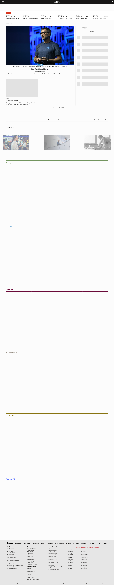
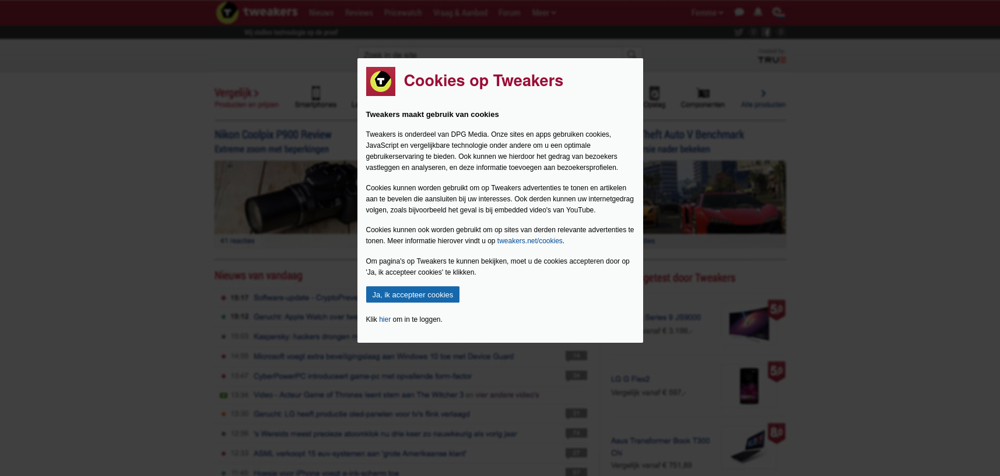
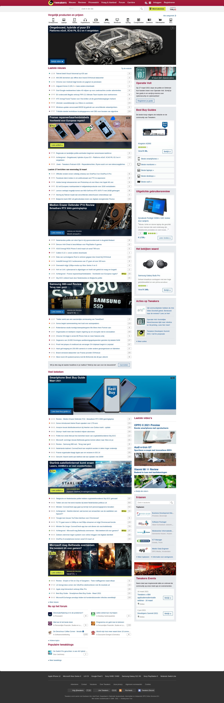
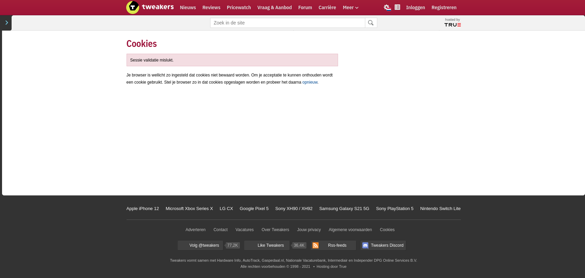

# Opdracht 2 - Breek het web

Ik ga voor de twee features JavaScript en cookies onderzoeken wat de problemen, meningen en oplossingen zijn. Hierbij test ik het op de website van [Forbes](https://www.forbes.com/), [Tweakers](https://tweakers.net/) en [Vimeo](https://vimeo.com/).

## JavaScript

JavaScript is alom aanwezig. Het gaat zelfs zo ver dat veel websites alleen op JavaScript werken en niet zonder kunnen. Daardoor ontstaan er snel problemen. Maar hoeveel mensen zetten JavaScript uitstaan? Volgens [Blockmetry](https://blockmetry.com/blog/javascript-disabled) had in het laatste kwartaal van 2016 0.2% van het werelwijd aantal websitebezoeken van alle apparaten in Groot-Brittannië JavaScript uitstaan. Maar Jake Archibald heeft een mooie quote:

> All your users are non-JS while they’re downloading your JS.

Je hebt altijd eerst een non-JS ervaring als je een website laadt. Ook kan er door problemen als fouten in de code en netwerkproblemen ervoor zorgen dat je niet de "JavaScript ervaring" krijgt.

Het afhankelijk maken van je website met JavaScript kan grote gevolgen hebben. Bijvoorbeeld in 2017 waar websites die van Amazon's servers JavaScript-bestanden wilden laden niet meer werkte doordat de server eruit lag. Miljoenen websites die daar afhankelijk van waren werkten niet meer.

Het uitzetten van JavaScript kan ook voordelen geven. Bijvoorbeeld hoe snel een website geladen wordt. Omdat er geen JavaScript bestanden hoeven worden geladen, is het aantal bestanden dat moet worden verstuurd kleiner. Waardoor je sneller de website kan gebruiken.

Een oplossing om toch gebruik te kunnen maken van een website, ook als sommige features van JavaScript niet werken is om gebruik te maken van *feature detection*. Met feature detection kijk je of een feature wordt ondersteund. Als dat niet zo is, moet je een basis hebben wat zonder die feature ook zal werken. Een voorbeeld van feature detection in code die in het artikel [Optimizing content for different browsers: the RIGHT way](https://www.w3.org/community/webed/wiki/Optimizing_content_for_different_browsers:_the_RIGHT_way) van W3 wordt beschreven, ziet er als volgt uit:

```javascript
if(!!document.createElement('video').canPlayType === true) {
  // run some code that relies on HTML5 video
} else {
  // do something else
}
```


Een andere manier om toch nieuwe features te laten werken in de browser is door *polyfills* te gebruiken. Dit is een methode waar de feature door middel van JavaScript-bestand toch kan werken in de browser. Alleen is dat niet aanbevolen, omdat je niet begint vanuit een basis en daardoor niet denkt aan de basiservaring, waardoor het alsnog fout kan gaan.
 
### Hoe te testen?

Je kunt testen hoe een website zonder JavaScript werkt door naar de developer tools menu te gaan. Daar klik je op het icoontje met de drie stippen waardoor je naar de instellingen gaat. In de instellingen is er een optie om JavaScript uit te zetten. Zet die aan en JavaScript zal niet werken.

Daarnaast heb je ook add-ons voor je browser waarmee je JavaScript kunt uitzetten. Add-ons als **Web Developer** (voor [Chrome](https://chrome.google.com/webstore/detail/web-developer/bfbameneiokkgbdmiekhjnmfkcnldhhm?hl=nl) en [Firefox](https://addons.mozilla.org/en-US/firefox/addon/web-developer/?utm_source=addons.mozilla.org&utm_medium=referral&utm_content=search)) en **NoScript Security Suite** (voor [Firefox](https://addons.mozilla.org/en-US/firefox/addon/noscript/?utm_source=addons.mozilla.org&utm_medium=referral&utm_content=search) en [Chrome](https://chrome.google.com/webstore/detail/noscript/doojmbjmlfjjnbmnoijecmcbfeoakpjm/))

### Wat gebeurt er als JavaScript uit staat?

Als ik kijk naar de websites die ik heb onderzocht, zie ik het volgende...

#### Forbes

Als eerst heb ik gekeken naar de website van Forbes.



Wat je kunt zien is dat het best wel afhankelijk is van JavaScript om artikelen in te laden. Alleen het belangrijkste artikel is daardwerkelijk zichtbaar. Verder werkt de navigeerknop niet waardoor ik niet door de website heen kan navigeren. Om te kunnen navigeren door de website moet je helemaal naar beneden de pagina gaan om de links te vinden. Ik vind het raar dat ze een hamburgermenu gebruiken, omdat er genoeg ruimte is om links naar belangrijke pagina's erin te zetten. Verder werkt de zoekknop ook niet. Die maakt waarschijnlijk gebruik van directe validatie en zoekresulaten. Ook worden de afbeeldingen niet geladen. Over het algeheel voelt het best leeg aan.


Op de pagina *Business* ziet het er iets beter uit maar het blijft nog steeds niet optimaal. Van de belangrijkste artikelen worden de afbeeldingen niet geladen, terwijl daaronder wel de afbeeldingen kunnen laden. Dit vind ik raar. Blijkbaar kan het wel, maar niet voor de belangrijkste artikelen.

#### Tweakers

Als tweede heb ik gekeken naar Tweakers.



Als eerst kreeg ik een melding om cookies te accepteren. Ik vertel meer wat ik heb gevonden over cookies bij [Wat als je cookies uitschakeld?](#wat-als-je-cookies-uitschakeld). 




Als ik ze accepteer zie dat de website er compleet uitziet. Alle afbeeldingen laden en ik zie niets dat mist of niet laad. Ook het zoeken werkt. Het enige dat niet werkt is de *meer*-knop en het selecteren van de taal, maar anders dan dat werkt alles.

#### Vimeo

Als laatste website heb ik gekeken naar Vimeo.


Niks... Helemaal niks. Hier kan ik kort over zijn: het werkt niet zonder JavaScript.

### Bronnen

* [5 Common Causes of JavaScript Errors (and How to Avoid Them)](https://geekflare.com/javascript-common-errors/)
* [Handling common JavaScript problems](https://developer.mozilla.org/en-US/docs/Learn/Tools_and_testing/Cross_browser_testing/JavaScript)
* [Fixing Javascript Cross Browser Compatibility Issues](https://www.lambdatest.com/blog/fixing-javascript-cross-browser-compatibility-issues/)
* [I Used The Web For A Day With JavaScript Turned Off](https://www.smashingmagazine.com/2018/05/using-the-web-with-javascript-turned-off/)
* [Why and how to build a website without JavaScript](https://medium.com/@larsdouweschuitema/why-and-how-to-build-a-website-without-javascript-a220830afadb)
* [Your Site without JavaScript](https://www.sitepoint.com/calibre-your-site-without-javascript/)
* [Optimizing content for different browsers: the RIGHT way - W3](https://www.w3.org/community/webed/wiki/Optimizing_content_for_different_browsers:_the_RIGHT_way)
* [JavaScript isn’t always available and it’s not the user’s fault](https://adamsilver.io/blog/javascript-isnt-always-available-and-its-not-the-users-fault/)
[“Must Work Without JavaScript”](https://meiert.com/en/blog/must-work-without-javascript/)
* [Why we should support users with no JavaScript](http://www.punkchip.com/why-support-javascript-disabled/)

## Cookies

Cookies zijn kleine delen informatie in tekstbestandjes die worden bewaard op je computer. Als je een HTTP-request maakt kan zo'n cookie worden meegegeven die informatie bevat, meestal of je bent ingelogd op een website of om te zien wat jouw website-instellingen zijn.

Cookies kunnen echter ook worden gebruikt om je te volgen over het web. Dit gebeurt met tracking-cookies, en dit zijn meestal *third-party-cookies*. Als je een website bezoekt die gebruik maakt van een advertentie, dan wordt er een JavaScript-bestand van een derde partij geladen die daarmee een cookie kan plaatsen op je computer om jouw te volgen. Als je dan naar een andere website gaat met een script van dezelfde partij kan die weten welke websites jij bezoekt.

Gelukkig is er in de meeste browsers een optie om cookies te niet toe te staan en kun je zelf instellen welke cookies je wel of niet toestaat.

In Nederland zijn er twee weten die regelen wat er met cookies mag: de Telecommunicatiewet (Tw) en de AVG (Algemene Verordening Gegevensbescherming) ingevoerd. Daarmee werd het gebruik van cookies zonder toestemming niet meer toegestaan. Dat betekende dat websites eerst toestemming moeten vragen aan de gebruiker om cookies te plaatsen. Daarbij is het niet toegestaan om cookiewalls te gebruiken en ook niet vooraf met "ja" ingevuld cookies te plaatsen. Dit wordt door websites flink aan de laars gelapt. Uit onderzoek van de Autoriteit Persoonsgegevens bij ongeveer 175 websites waren er veel websites die op onjuiste wijze toestemming vragen voor plaatsen tracking cookies. Ook het gebruik van cookiewalls wordt nog flink gebruikt. En ook uit een studie van onderzoekers van universiteiten uit Denemarken, Londen en MIT bleek dat alleen 11.8% van de websites voldoen aan de AVG. Hieruit blijkt wel uit dat het gebruik van (tracking-)cookies nog veel gebruikt wordt.

### Hoe te testen?

In de browser-instellingen kun je cookies blokkeren.

### Wat als je cookies uitschakeld?

Ik heb voor het onderzoek weer gekeken naar de drie websites Forbes, Tweakers en Vimeo. En daar kwam dit naar voren...

#### Forbes

Bij Forbes zie ik niet een effect bij het blokkeren van cookies. Ik kan gewoon artikelen lezen en op elke pagina komen. Ik weet alleen niet of het gebruik maakt van cookies, omdat ik geen cookiemelding te zien krijg om toestemming te geven.

#### Tweakers

Bij Tweakers kom ik gelijk een cookiewall tegen.


Deze cookiewall mag niet volgens de wet en je hebt hier ook geen keuze om coookies niet te accepteren.



Als ik op "Ja, ik accepteer cookies" klik, krijg ik een foutmelding te zien die zegt dat de sessie validatie is mislukt. Daaronder zegt het iets bijzonders: "Om je acceptatie te kunnen onthouden wordt een cookie gebruikt". Dus om te om te onthouden of ik wel/niet cookies accepteer worden cookies gebruikt. Maar waar worden die cookies dan anders voor gebruikt?

#### Vimeo

Als laatst heb ik gekeken naar Vimeo.


Hier zie ik op de homepagina geen cookiemelding. Maar dat zou wel moeten, omdat ze gebruik maken van cookies om in te loggen.


Daarna ben ik naar de video-pagina gegaan waar alle video's staan die je kunt bekijken. Maar je kunt niets bekijken, want blijkbaar heb je daarvoor cookies nodig. Best raar, want je hebt helemaal geen cookies nodig om video's af te spelen. Willen ze misschien weten wat ik kijk..?

### Bronnen

* [How to Control and Delete Cookies on Your Browser](https://www.pcmag.com/how-to/how-to-control-and-delete-cookies-on-your-browser)
* [Cookie consent: Most websites break law by making it hard to 'reject all' tracking](https://www.zdnet.com/article/cookie-consent-most-websites-break-law-by-making-it-hard-to-reject-all-tracking/)
* [What Is a Browser Cookie? - How-To-Geek](https://www.howtogeek.com/119458/htg-explains-whats-a-browser-cookie/)
* [AP: veel websites vragen op onjuiste wijze toestemming voor plaatsen tracking cookies - Autoriteit Persoonsgegevens](https://autoriteitpersoonsgegevens.nl/nl/nieuws/ap-veel-websites-vragen-op-onjuiste-wijze-toestemming-voor-plaatsen-tracking-cookies)
* [Cookies - Autoriteit Persoonsgegevens](https://autoriteitpersoonsgegevens.nl/nl/onderwerpen/internet-telefoon-tv-en-post/cookies)