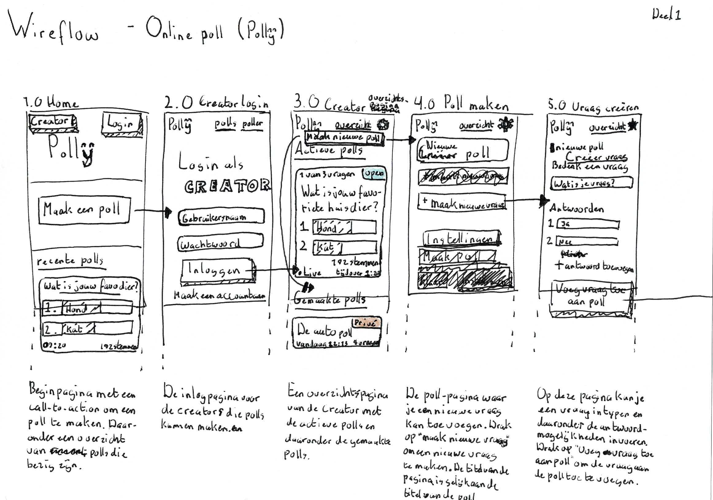

# Use Case - Polly

De use-case die ik heb gekozen is een **online poll met resultaten**.

> Ik wil tijdens een college aan studenten een poll kunnen voorleggen met vragen en antwoorden, en de resultaten meteen laten zien.

Ik heb het de naam **Polly** gegeven. Met Polly kun je polls maken.

## Wireflow en schetsen

Als eerst heb ik wat geschetst en eisen neergezet.

Daarna heb ik een wireflow gemaakt voor hoe het gaat werken.

Deze wireflow geeft vooral de *Creator*-flow (of admin-flow) weer.

## Browser technologies

* [Websockets API](#websockets)
* [Gamepad API](#gamepad)

### Websockets API

Websocket is

#### Functionaliteit Websockets

#### Toegankelijkheid Websockets

#### Browser ondersteuning voor Websockets

### Gamepad API

In

#### Functionaliteit Gamepad API

#### Toegankelijkheid Gamepad API

#### Browser ondersteuning voor Gamepad API

