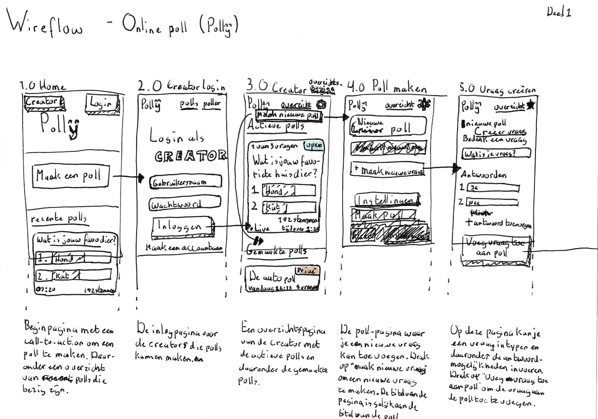
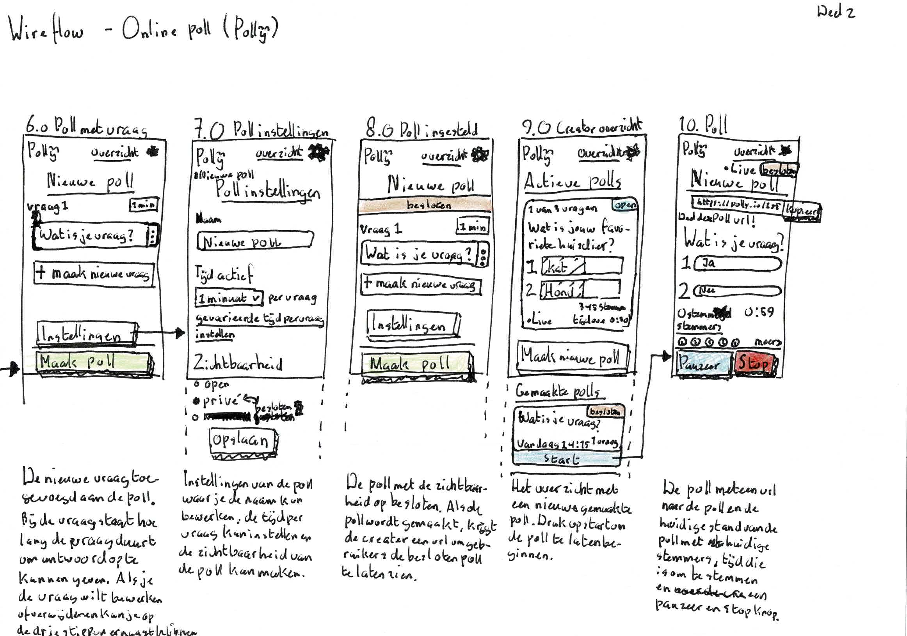

# Polly

Create polls, share polls, join and vote!

[**Go to the website >**](https://polly-y.herokuapp.com/)

## Table of Contents

1. [**Dependencies**](#dependencies)
2. [**Installation**](#installation)
3. [**Functionalities**](#functionalities)
4. [**Wireflow**](#wireflow)
5. [**Testing**](#testing)
6. [**Miscellaneous**](#miscellaneous)

## Dependencies

* Express
* Express-handlebars

For other dependencies see [**`package.json`**](package.json)

## Installation

1. Clone the repository and navigate to the directory.

2. **Install dependencies:**

	```bash
	npm install
	```

### Run application

```bash
# To run the server
npm run start

# To run the development environment
npm run dev
```

## Functionalities

The main functionalities of Polly consists of:

1. **Creating a poll** with the option to add up to 5 questions, and for each question up to 5 answers. The creator can choose the order of the questions being asked. Each question has a set time for users to vote.
2. **Joining a poll and vote**. The creator of the poll can control when the result will be shown.
3. **Joining a group with polls only for members**. Polls created by the creator of the group are only accessible to members, and members will immediately be notified when a new poll has been started.

### Functional/Reliable layer

The Creator (Admin) can create a poll, edit, delete and publish the poll. When editing the poll new questions can be created. All this is done with standard HTML forms with the data being processed on the server and the results send back. With the **update** button the page will reloaded and new results will be displayed.

The user can see polls that are open to the public and vote on the poll. This is done with standard HTML forms.

### Usable layer

No more ***update** buttons with user input being submitted asynchronously using AJAX. Improved user experience by adding styles for better visual hierarchy.

### Pleasurable layer

Dark mode and animations for supported browsers and real-time poll results.

## Browser Technology

I use the **WebSockets API** to send votes to the server and  display results in real-time.

With the Websockets API it is possible to create a seamless connection between the client and server with the data transfered in real-time to and from the server.

### Fallbacks

If the WebSockets API isn't supported it will try to detect if the **Fetch API** is available. If so then the new results will be periodically fetched from the server.

If the two API's are not supported it will fall back to the HTML version.

### Browser support

The **WebSockets API** is supported in the following browsers:

* Chrome (4^)
* Edge (12^)
* Firefox (11^)
* Internet Explorer (10^)
* Opera (12.1^)
* Safari (5^)

Mobile:

* Chrome Android (18^)
* Firefox for Android (14^)
* Opera Android (12.1^)
* iOS Safari (4.2^)
* Samsung Internet

Websockets are not supported in:

* Opera mini

## Wireflow





This wireflow shows the *Creator*-flow (or admin-flow) of the website.

## Testing

List of devices and browsers used for testing:

* [Browsers](https://github.com/qiubee/access-for-all/wiki/test#browsers)
	* [Firefox 86.0.1](https://github.com/qiubee/access-for-all/wiki/test#firefox)
	* [Brave 1.22.67 (Chromium 89)](https://github.com/qiubee/access-for-all/wiki/test#brave)
* [Mobile](https://github.com/qiubee/access-for-all/wiki/test#mobile)
	* [iOS Safari 9 (iPod Touch)](https://github.com/qiubee/access-for-all/wiki/test#ios-safari-9)
	* [Mobile Firefox (LG)](https://github.com/qiubee/access-for-all/wiki/test#mobile-firefox)

[**Lees test verslag**](https://github.com/qiubee/access-for-all/wiki/test)

## Miscellaneous

The results of the assingments about *Progressive Enhancement* and feature testing is located in the [**assignments**](/assignments) folder.

### License

[**MIT**](LICENSE)
